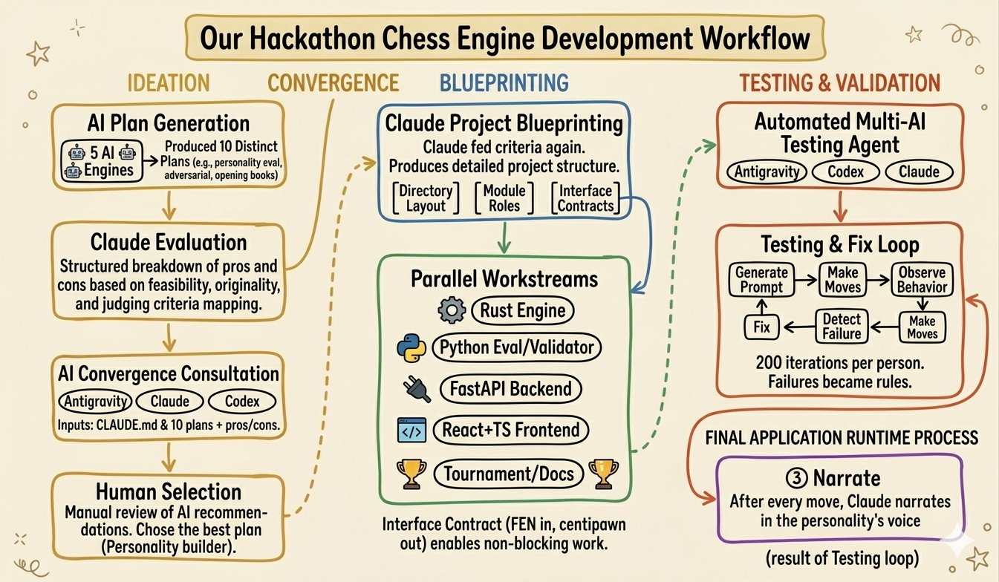
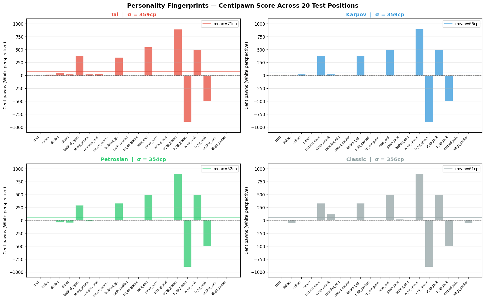
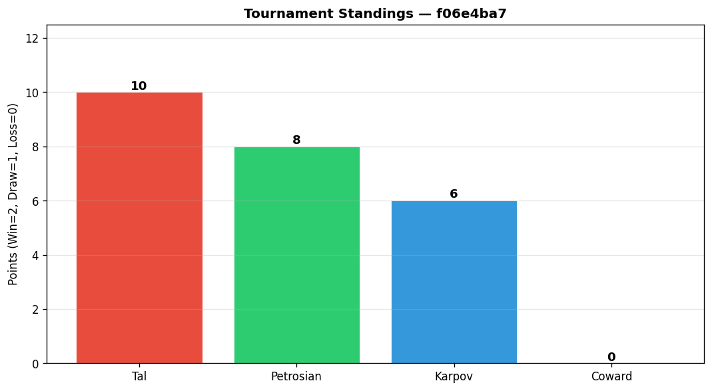

# Chess Forge — Hackathon Presentation

## 1. Opening Pitch

Chess platforms already have personality bots. You can play "Magnus," "Hikaru," or a preset aggressive bot.

But those personalities are mostly fixed products. You choose them; you do not create them. You also rarely get to see how the bot actually thinks.

Chess Forge asks a different question:

> What if you could describe any chess personality in plain English, watch Claude write its evaluation function live, then play against that engine and benchmark it in a tournament?

Examples:

```text
play like cubist quant developer
play like president obama
play like a reckless attacker
only move pawns if possible
play like a coward who avoids all trades
```

Each prompt becomes a real chess engine personality. The engine does not just get a new name or skin; its position evaluation logic changes.

---

## 2. How We Built It

### Phase 1: Ideation

We started with five AI engines and generated ten distinct idea plans covering a range of approaches — from personality-driven eval functions to adversarial self-play trainers to opening-book generators.

We then asked Claude to evaluate each plan, producing a structured breakdown of pros and cons:

- feasibility within hackathon time constraints
- originality relative to existing chess engines
- how well it mapped to the judging criteria (engine quality, AI usage, process, engineering)

### Phase 2: Convergence

With ten plans evaluated, we ran a second round of AI consultation. We fed each of three AI systems — **Antigravity**, **Claude**, and **Codex** — the same inputs:

1. The `CLAUDE.md` file with full hackathon criteria
2. The ten idea plans with their pros and cons

Each was asked to produce one final recommended plan, either by choosing the strongest idea or integrating the best elements across ideas.

We then manually read all three final plans and chose the one that made the most sense: the natural-language personality builder backed by a generated eval function and a Rust search engine. It had the clearest scope, the best story for AI usage, and the most natural parallelization.

### Phase 3: Planning

With the idea confirmed, we returned to Claude. Feeding it the `CLAUDE.md` criteria again, we asked it to produce a complete project structure: directory layout, module responsibilities, and interface contracts between components.

This gave us a shared blueprint before anyone wrote a line of code.

### Phase 4: Implementation

We split the project into five parallel workstreams so multiple AI accounts and team members could work independently:

1. Rust chess engine (search, UCI protocol)
2. Python eval generator and validator
3. FastAPI backend and WebSocket layer
4. React + TypeScript frontend
5. Tournament runner, testing, and documentation

The interface contract — FEN string in, centipawn integer out — let each workstream proceed without blocking the others.

### Phase 5: Testing

After implementation, each team member independently ran the full application and tested manually. We then built a testing agent combining **Antigravity**, **Codex**, and **Claude** that automated this loop:

1. Generate a test prompt (e.g. a personality description or edge-case position)
2. Send the prompt to the running system
3. Make moves on the board and observe behavior
4. Detect any failures or regressions
5. Fix the issue
6. Repeat

We ran **200 iterations per person** across separate Claude Code sessions. Each failure became either a validation rule, a prompt constraint, or a fallback behavior — the same feedback loop that produced the five-gate validator and the EGRI metric described in the Results section.



---

## 3. What We Built / Demo Flow

Chess Forge is an AI chess personality lab with five core pieces:

1. **Natural-language personality builder**
   - User describes a chess style.
   - Claude turns it into a chess-expressible strategy.

2. **Generated evaluation functions**
   - Claude writes a Python `evaluate(board) -> int` function.
   - That function returns a centipawn score.
   - The eval function becomes the personality's "brain."

3. **Rust chess engine**
   - Rust handles legal chess and search.
   - The engine uses alpha-beta search, iterative deepening, quiescence search, move ordering, and a transposition table.

4. **Interactive frontend**
   - Users see the generated code.
   - They play against the engine.
   - They see eval score, principal variation, win probability, and commentary.

5. **Tournament runner**
   - User-generated engines compete against built-in personalities:
     - Tal
     - Karpov
     - Petrosian
     - Classic baseline
   - Results are saved as JSON and displayed in the UI.

Run:

```bash
make dev
```

Then:

1. Type a personality:

```text
play like a cubist quant developer
```

2. Claude interprets it as a chess strategy.
3. Claude generates the eval function.
4. The app validates the generated code.
5. The generated code appears in the UI.
6. User plays against the engine.
7. The UI shows:
   - board state
   - centipawn score
   - win probability bar
   - principal variation
   - commentary in the personality's voice
8. Click **Run Tournament**.
9. The generated engine plays a round-robin against built-in personalities.

One-line demo close:

> One text box. Any chess personality. Claude writes the brain, Rust plays the chess, and the tournament proves whether the personality actually behaves differently.

---

## 4. Chess Engine Core & Protocols and Foundations

The chess engine is written in Rust.

Core engine features:

- Legal move handling through `shakmaty`
- Negamax search
- Alpha-beta pruning
- Iterative deepening
- Quiescence search
- Move ordering
- Transposition table
- Built-in fallback material evaluation

Claude controls the personality through evaluation. Rust controls legality, search, and protocol behavior.

This split keeps the project stable:

- AI can generate style.
- Rust guarantees the engine still plays legal chess.

---

Chess Forge builds on existing chess-engine protocols and formats.

### UCI: Universal Chess Interface

The Rust engine speaks UCI, the standard protocol used by chess engines and GUIs.

Example:

```text
uci
id name ChessForge
id author Chess Cubist
uciok
isready
readyok
position startpos moves e2e4 e7e5
go movetime 500 depth 4
bestmove g1f3
```

Why this matters:

- The engine can be tested outside our frontend.
- It can load into standard chess GUIs.
- It demonstrates research into chess-engine prior art.

## System Architecture

```text
User prompt
   |
   v
Claude Haiku interpretation
   |
   v
Claude Sonnet code generation
   |
   v
Five-gate validator
   |
   v
Saved Python evaluate(board) function
   |
   v
Rust UCI engine search
   |
   v
Python eval server over FEN stdin/stdout
   |
   v
Best move + eval + principal variation
   |
   v
FastAPI WebSocket
   |
   v
React UI + commentary + tournament results
```

Technology stack:

- Rust engine
- Python eval pipeline
- FastAPI backend
- React + TypeScript frontend
- WebSockets for live game updates
- UCI for engine protocol
- FEN for board serialization
- python-chess for generated eval board queries
- shakmaty for Rust-side chess representation

---

## 6. Testing &  Results

We tested the system at multiple levels.

| Test Module | Purpose |
|-------------|---------|
| `test_perft.py` | Validates move generation against known node counts |
| `test_eval.py` | Checks eval symmetry, material detection, and sane scores |
| `test_generator.py` | Tests validation gates and fallback behavior |
| `test_search.py` | Checks UCI/search behavior on tactical positions |
| `test_tournament.py` | Checks bracket math, W/D/L accounting, and JSON output |

Additional integration check:

```bash
make agent
```

This runs:

1. build check
2. eval check
3. generator check
4. UCI handshake check
5. pipeline check with live games

# Quality Metrics

Through these metrics we prove the personalities are measurable: prompt reliability, personality fingerprints, commentary consistency, and tournament standings.

### Prompt Reliability


**EGRI: Eval Generation Reliability Index**

Grey bars track syntax pass rate. Green bars track all five validation gates. It is calculated as:

```text
functions passing all gates / total generation attempts
```

We started with generated-code failures:

- invalid Python
- unsafe imports
- `random`
- wrong sign conventions
- bad use of `board.king()`
- constant eval functions

Each failure became a validation rule, prompt constraint, or fallback behavior.

### Personality Distinctness



Each personality's evaluate() function is called on 20 chess positions spanning openings, middlegames, and endgames, returning a centipawn score for each. Those 20 scores are plotted as a bar chart: the shape and spread of that chart is the fingerprint.


The distinctiveness score uses pairwise Cohen's d over the personality fingerprints. Large effects mean two engines evaluate the same positions in genuinely different ways.

Cohen's d = |mean_A - mean_B| / pooled_std_dev

Computed for every pair (Tal vs Karpov, Tal vs Petrosian, etc.) using their 20-position fingerprint scores as the distributions. The thresholds: d < 0.2 = negligible (basically the same engine), d > 0.8 = large effect (statistically different).
* The key test: Tal (aggressive) vs Petrosian (defensive) should have the largest d.


**PPAR: Philosophy-Play Alignment Rate**

PPAR compares each personality's score to the Classic baseline across attack, structure, and defense positions. 20 positions are grouped into three categories (attack positions, structural positions, defensive positions). For each category:

Personality Delta = avg(personality_score - classic_score) across positions in that category

Expected pattern:
- Tal should like attack positions.
- Karpov should like structure positions.
- Petrosian should like defensive positions.


CCS checks whether generated commentary uses language consistent with the personality: aggressive, positional, or defensive.

An aggressive engine should produce commentary with words like "attack", "sacrifice", "open file" — not "fortress", "prophylaxis", "consolidate".

Each personality has a style lexicon (list of keyword stems). For each commentary line, every word is checked for substring matches against that lexicon:

CCS = keyword_hits / total_words


For example:

- Tal-style evals reward attack and activity.
- Karpov-style evals reward structure and pressure.
- Petrosian-style evals reward king safety and defensive solidity.
- A "Coward" personality performs poorly because it avoids useful activity.

### Tournament Results



Tournament play lets us evaluate generated personalities empirically. Every engine plays every other engine twice. Win = 2 points, draw = 1, loss = 0.

The "Coward" engine scoring 0 in one run is a useful result: it shows that an intentionally passive generated personality changes game outcomes, not only eval text.

Recent played Magnus tournament:

```text
Magnus:    2W / 0D / 1L
Tal:       1W / 0D / 2L
Karpov:    2W / 0D / 1L
Petrosian: 1W / 0D / 2L
```


## Quick Reference for Q&A

| Fact | Value |
|------|-------|
| Main idea | Natural-language chess engine personalities |
| Engine language | Rust |
| Eval language | Python |
| Frontend | React + TypeScript |
| Backend | FastAPI |
| Engine protocol | UCI |
| Board serialization | FEN |
| Eval unit | Centipawns |
| Validation gates | 5 |
| Built-in opponents | Tal, Karpov, Petrosian, Classic |
| Main tests | perft, eval, generator, search, tournament |
| AI touchpoints | interpret, generate, narrate |
| Main reliability fix | Validate Claude output and fallback on malformed/truncated/timed-out code |
