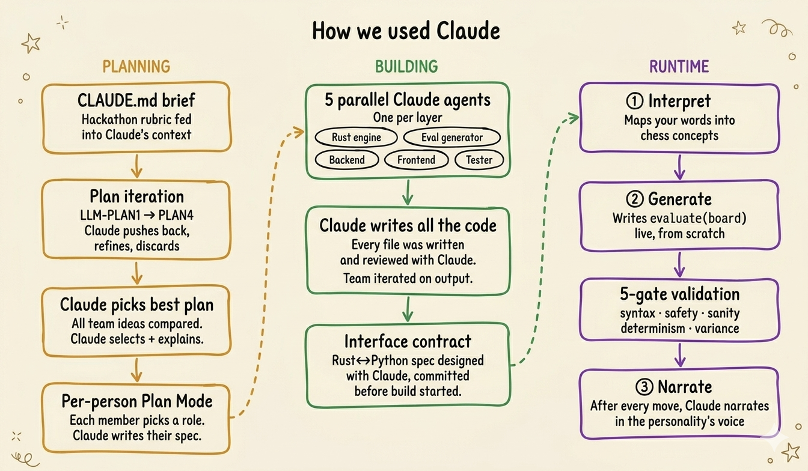
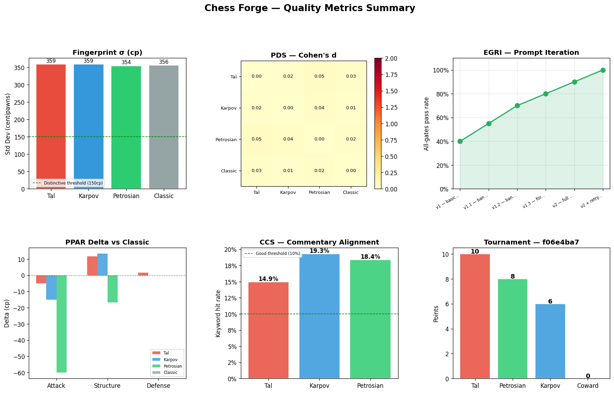
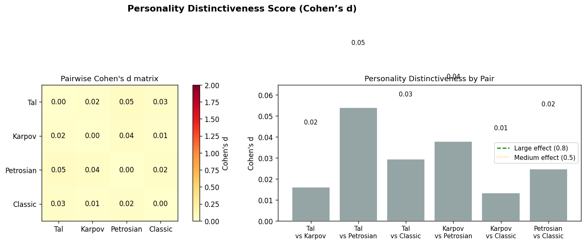
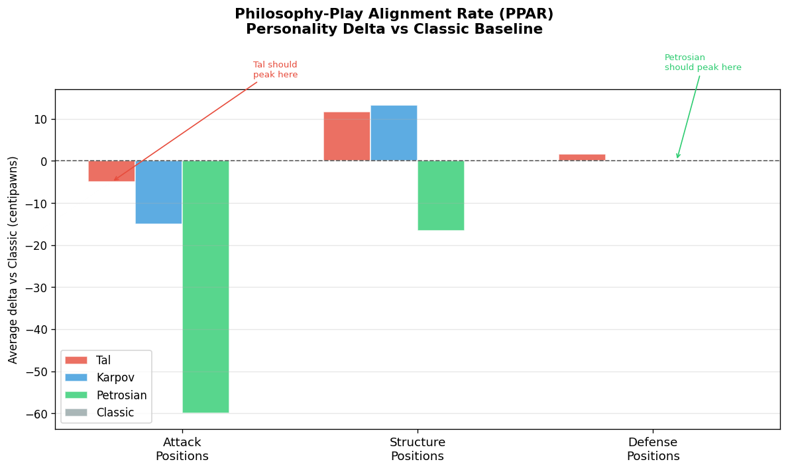

# Chess Forge — Presentation Script

---

## The Problem & The Idea

Chess.com has personality bots — Magnus, Hikaru, preset styles. You pick one and play. That's it. You can't invent your opponent. You can't see how it thinks. The AI is a skin on top.

We asked: what if you could *describe* any chess personality in plain English, and the engine's actual brain gets written live, on screen, in front of you?

> *"A paranoid coward that never attacks"*
> *"A suicidal gambler that sacrifices everything for an attack"*
> *"An obsessive pawn hoarder that never trades material"*

Each one becomes a different engine with different logic. You play against your own creation, watch it narrate its moves in character, and then pit it against classic grandmaster styles in a live tournament.

That's Chess Forge.

---

## How We Used Claude to Plan & Build

**Claude wasn't just a tool — it was a team member**

**Planning:**
- Fed the hackathon rubric into a `CLAUDE.md` file — Claude read the judging criteria first
- Iterated through four plan files (`LLM-PLAN1` → `PLAN4`), getting pushback, refinements, and discarded ideas each round
- Submitted all team plans; Claude compared them and picked the strongest one
- Claude wrote a five-person implementation plan — each of us selected a role, and Plan Mode generated our individual specs

**Building:**
- Every team member had their own Claude agent focused on their layer — Rust engine, eval generator, backend, frontend, tester
- Claude wrote essentially all the code
- The Rust-Python interface contract was designed in conversation with Claude and committed as a spec *before* either side was built — both streams built in parallel without stepping on each other

---

## How Claude Works Inside the Engine

**Every time you type a philosophy, this pipeline runs:**

1. **Interpret (Claude Haiku)** — Maps your description to a chess-expressible concept. "Paranoid coward" becomes: *"Maximizes king safety, penalizes open files near own king, avoids all trades."* Impossible inputs like "only move pawns" get redirected gracefully.

2. **Generate (Claude Sonnet)** — Writes a Python `evaluate(board) -> int` function from scratch, live. The code appears on screen as it generates. This function decides how the engine values every position.

3. **5-gate validation** — Before the engine touches a game: syntax, safety, sanity on canonical positions, determinism, variance. Any failure surfaces the exact error and prompts a rephrase.

4. **Rust calls Python at every node** — For each leaf node in the search tree, Rust sends a FEN to the Python eval server and gets back a centipawn score. The personality runs at the heart of every search.

5. **Narrate (Claude Haiku)** — After every engine move, Claude writes one sentence in the personality's voice: *"The Coward tucks the bishop back, unwilling to risk a single exchange."*

---

## The Engineering

- **Rust engine** — alpha-beta, iterative deepening, quiescence search, transposition table, MVV-LVA. UCI compliant — loads into any chess GUI in the world
- **Persistent eval bridge** — Rust spawns one Python process per game. FEN in, centipawn score out. No recompiling for new personalities
- **Test suite** — perft tests at depth 1–4 (including Kiwipete), mate-in-N, eval sanity, 5-gate generator tests
- **Pipeline tester** — `make agent` runs 5 automated checks end-to-end: build, eval server, generator, UCI handshake, 3 live games
- **Prompt iteration logged** — every prompt is in `prompts/` with iteration notes. The AI usage story is documented, not just claimed

**We measured prompt quality rigorously:**

> **Eval Generation Reliability Index (EGRI)** — two bars per prompt version: grey = syntax pass rate, green = all 5 validation gates pass rate. Calculated as `(functions passing all gates) / (total generation attempts)` across 20 sample generations per round. Each annotation names the exact bug class that caused failures at that version. Starts at 40% (v1) and reaches 100% (v2 + retry loop) after six prompt iterations. Higher is better — a flat green bar at 100% means the codegen prompt is fully hardened against known failure modes.

## Demo

`make dev` → type a philosophy → Generate → Play → Tournament

**Closer:**
> *"One text box. Any chess personality you can describe. Claude writes the brain, the Rust engine plays it, and Claude narrates every move in character. That's Chess Forge."*

---
---

## Results

> **Quality Metrics Summary** — a six-panel dashboard showing all metrics at once. Top row (left to right): Fingerprint σ (how opinionated each engine is), Cohen's d heatmap (how distinct each pair is), EGRI over prompt iterations. Bottom row: PPAR delta chart, CCS commentary alignment bars, tournament final standings. Each panel is a condensed version of the detailed charts below. Use this as the one-slide proof that personalities differ in measurably different ways.

---

**Personalities are provably distinct:**

> **Personality Fingerprints** — four bar charts, one per engine, showing the centipawn score assigned to each of the 20 test positions (x-axis: position label, y-axis: centipawns from White's perspective). The horizontal line is the mean across all positions; the subtitle shows σ (standard deviation). A wide spread = the engine has strong opinions. A flat distribution = the personality is getting drowned out by material. Calculated by calling `evaluate(chess.Board(fen))` on each position and clipping to ±2000cp.

> **Personality Distinctiveness Score (PDS / Cohen's d)** — left panel: heatmap of all pairwise Cohen's d values; right panel: bar chart of the same values for each unique pair. Cohen's d = `|mean_A − mean_B| / pooled_std_dev` computed over each engine's 20-position fingerprint scores. Colour coding: red bars = large effect (d ≥ 0.8, genuinely different play), orange = medium (0.5–0.8), grey = small (< 0.5). The key test: Tal vs Petrosian should have the highest d — they are philosophically opposite.

> **Philosophy-Play Alignment Rate (PPAR)** — grouped bar chart with three position categories on the x-axis (Attack, Structure, Defense) and one bar per engine. Each bar shows the average centipawn delta vs. the Classic baseline: `avg(personality_score − classic_score)` across positions in that category. Positive delta = the engine rates those positions more favourably than pure material counting would predict — the personality is showing up. Expected pattern: Tal positive on Attack, Karpov positive on Structure, Petrosian positive on Defense. Deviations from this pattern flag a personality that isn't translating philosophy into evaluation.

> **Commentary Consistency Score (CCS)** — three panels, one per personality. Each panel shows three bars: the keyword hit rate against the aggressive, positional, and defensive lexicons. The green bar is the engine's own expected style. Calculated as `keyword_hits / total_words`, where a hit is any word containing a keyword stem (e.g. "attack", "sacrifice", "open" for aggressive). The correct style bar should be tallest — if it isn't, the commentary isn't personality-specific.

**Tournament standings:**

> **Tournament Standings** — bar chart of final points (Win = 2, Draw = 1, Loss = 0) from a round-robin where every engine plays every other engine twice. Points = `W × 2 + D`. Loaded directly from `tournament/results/{session_id}.json`. The Coward engine (user-generated, over-penalizes aggression) scoring 0 is the intended result — it validates that personality differences are large enough to determine game outcomes, not just evaluation scores.

---

## Quick Reference — Key Numbers for Q&A

| Fact | Value |
|------|-------|
| Lines of code | ~2,000 (all Claude-written) |
| Plan iterations | 4 (LLM-PLAN1 → PLAN4) |
| Validation gates | 5 |
| Claude touchpoints per game | 3 (interpret, generate, narrate per move) |
| Tournament opponents | Tal · Karpov · Petrosian |
| Test modules | 5 (perft, eval, generator, search, tournament) |
| Languages | Rust · Python · TypeScript |
| Engine protocol | UCI (Universal Chess Interface) |
