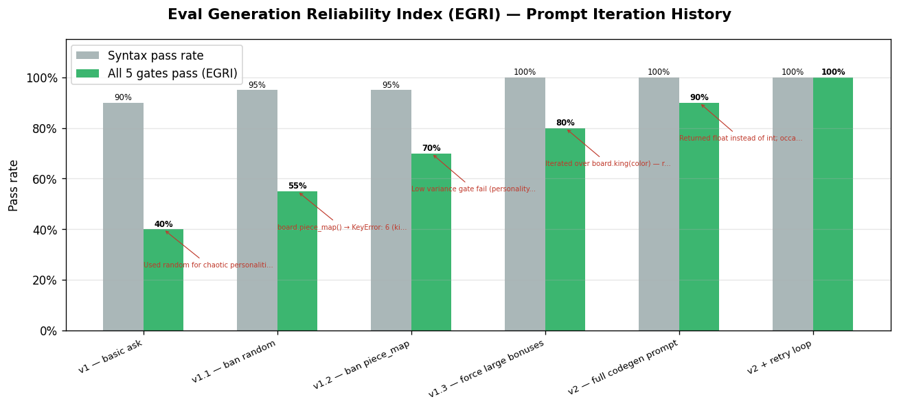
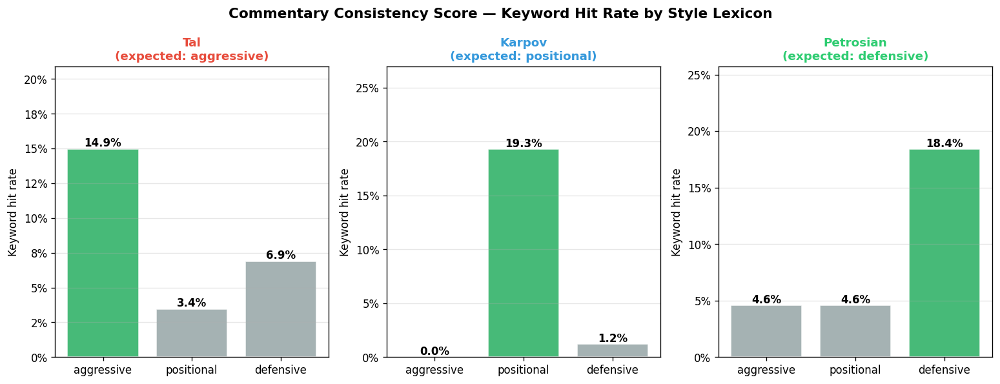

# Chess Forge — Hackathon Presentation

## 1. Opening Pitch

Chess platforms already have personality bots. You can play "Magnus," "Hikaru," or a preset aggressive bot.

But those personalities are mostly fixed products. You choose them; you do not create them. You also rarely get to see how the bot actually thinks.

Chess Forge asks a different question:

> What if you could describe any chess personality in plain English, watch Claude write its evaluation function live, then play against that engine and benchmark it in a tournament?

Examples:

```text
play like magnus carlsen
play like a reckless attacker
only move pawns if possible
play like a coward who avoids all trades
```

Each prompt becomes a real chess engine personality. The engine does not just get a new name or skin; its position evaluation logic changes.

---

## 2. What We Built

Chess Forge is an AI chess personality lab with five core pieces:

1. **Natural-language personality builder**
   - User describes a chess style.
   - Claude turns it into a chess-expressible strategy.

2. **Generated evaluation functions**
   - Claude writes a Python `evaluate(board) -> int` function.
   - That function returns a centipawn score.
   - The eval function becomes the personality's "brain."

3. **Rust chess engine**
   - Rust handles legal chess and search.
   - The engine uses alpha-beta search, iterative deepening, quiescence search, move ordering, and a transposition table.

4. **Interactive frontend**
   - Users see the generated code.
   - They play against the engine.
   - They see eval score, principal variation, win probability, and commentary.

5. **Tournament runner**
   - User-generated engines compete against built-in personalities:
     - Tal
     - Karpov
     - Petrosian
     - Classic baseline
   - Results are saved as JSON and displayed in the UI.

---

## 3. Demo Flow

Run:

```bash
make dev
```

Then:

1. Type a personality:

```text
play like magnus carlsen
```

2. Claude interprets it as a chess strategy.
3. Claude generates the eval function.
4. The app validates the generated code.
5. The generated code appears in the UI.
6. User plays against the engine.
7. The UI shows:
   - board state
   - centipawn score
   - win probability bar
   - principal variation
   - commentary in the personality's voice
8. Click **Run Tournament**.
9. The generated engine plays a round-robin against built-in personalities.

One-line demo close:

> One text box. Any chess personality. Claude writes the brain, Rust plays the chess, and the tournament proves whether the personality actually behaves differently.

---

## 4. How Claude Is Used

Claude appears in the system in three places.

### Step 1: Interpret the Personality

Model: Claude Haiku

Input:

```text
play like magnus carlsen
```

Output:

```text
Reward small positional advantages, centralized pieces, durable pawn structures,
active kings in simplified positions, and steady pressure over reckless material grabs.
```

Why Haiku:

- Fast
- Lower cost
- The task is short-form interpretation, not complex code generation

### Step 2: Generate the Evaluation Function

Model: Claude Sonnet

Claude writes:

```python
def evaluate(board: chess.Board) -> int:
    ...
```

This function scores a chess position in centipawns from White's perspective.

Why Sonnet:

- Code generation is more complex.
- It must reason about chess concepts and produce executable Python.

### Step 3: Narrate Moves

After the engine moves, Claude writes one sentence of commentary in the personality's voice.

Example:

```text
The Coward tucks the bishop back, unwilling to risk a single exchange.
```

This makes the engine's style legible to a human audience.

---

## 5. Critical AI Evaluation: The Five-Gate Validator

We do not trust generated code blindly.

Every generated eval function must pass five gates before it can play.

| Gate | What It Checks |
|------|----------------|
| **Syntax** | Code parses as valid Python |
| **Safety** | No unsafe imports or banned names like `os`, `subprocess`, `open`, `eval`, `exec`, `random`, or `time` |
| **Sanity** | Starting position is roughly equal; queen-up positions score correctly |
| **Determinism** | Same board returns the same score every time |
| **Variance** | Scores differ across positions, proving the eval is not constant |

### Real Failure We Found

The prompt:

```text
play like magnus carlsen
```

once produced malformed Python:

```text
Syntax error: expected an indented block (<unknown>, line 313)
```

We fixed this by hardening the generator:

- Full validation now runs on every Claude response.
- Truncated responses are detected.
- API timeouts are caught.
- Malformed code never reaches the UI.
- A prompt-aware local fallback eval is generated if Claude fails.

This is the core of our AI usage story: Claude is powerful, but we evaluate and contain its output.

---

## 6. Chess Engine Core

The chess engine is written in Rust.

Core engine features:

- Legal move handling through `shakmaty`
- Negamax search
- Alpha-beta pruning
- Iterative deepening
- Quiescence search
- Move ordering
- Transposition table
- Built-in fallback material evaluation

Claude controls the personality through evaluation. Rust controls legality, search, and protocol behavior.

This split keeps the project stable:

- AI can generate style.
- Rust guarantees the engine still plays legal chess.

---

## 7. Protocols and Foundations

Chess Forge builds on existing chess-engine protocols and formats.

### UCI: Universal Chess Interface

The Rust engine speaks UCI, the standard protocol used by chess engines and GUIs.

Example:

```text
uci
id name ChessForge
id author Chess Cubist
uciok
isready
readyok
position startpos moves e2e4 e7e5
go movetime 500 depth 4
bestmove g1f3
```

Why this matters:

- The engine can be tested outside our frontend.
- It can load into standard chess GUIs.
- It demonstrates research into chess-engine prior art.

### FEN: Board Serialization

Rust sends board states to Python as FEN strings.

FEN lets one line represent the whole board:

```text
rnbqkbnr/pppppppp/8/8/8/8/PPPPPPPP/RNBQKBNR w KQkq - 0 1
```

### Rust-to-Python Eval Protocol

Rust searches. Python evaluates.

Protocol:

```text
Rust   -> Python: <FEN string>\n
Python -> Rust:   <centipawn integer>\n
Rust   -> Python: quit\n
```

On error:

```text
Python -> Rust: ERR <message>\n
```

Rust substitutes a safe fallback score and continues.

### Centipawn Scores

The generated eval returns centipawns:

```text
100 centipawns = roughly 1 pawn
+100 = White is about one pawn better
-100 = Black is about one pawn better
```

The UI displays:

```text
+135 cp -> +1.35
```

### Win Probability

The backend converts centipawns into a White win probability:

```python
1 / (1 + 10 ** (-cp / 400))
```

So:

- `0 cp` is about 50%
- `+400 cp` is about 90%
- `-400 cp` is about 10%

---

## 8. System Architecture

```text
User prompt
   |
   v
Claude Haiku interpretation
   |
   v
Claude Sonnet code generation
   |
   v
Five-gate validator
   |
   v
Saved Python evaluate(board) function
   |
   v
Rust UCI engine search
   |
   v
Python eval server over FEN stdin/stdout
   |
   v
Best move + eval + principal variation
   |
   v
FastAPI WebSocket
   |
   v
React UI + commentary + tournament results
```

Technology stack:

- Rust engine
- Python eval pipeline
- FastAPI backend
- React + TypeScript frontend
- WebSockets for live game updates
- UCI for engine protocol
- FEN for board serialization
- python-chess for generated eval board queries
- shakmaty for Rust-side chess representation

---

## 9. Testing and Rigor

We tested the system at multiple levels.

| Test Module | Purpose |
|-------------|---------|
| `test_perft.py` | Validates move generation against known node counts |
| `test_eval.py` | Checks eval symmetry, material detection, and sane scores |
| `test_generator.py` | Tests validation gates and fallback behavior |
| `test_search.py` | Checks UCI/search behavior on tactical positions |
| `test_tournament.py` | Checks bracket math, W/D/L accounting, and JSON output |

Additional integration check:

```bash
make agent
```

This runs:

1. build check
2. eval check
3. generator check
4. UCI handshake check
5. pipeline check with live games

Recent testing:

- Generator tests: `12 passed`
- Tournament tests: `9 passed`
- Exact prompt `"play like magnus carlsen"` generated valid code
- Generated Magnus eval completed a tournament
- Fallback styles completed a tournament

---

## 10. Results


Through these metrics we prove the personalities are measurable: prompt reliability, personality fingerprints, commentary consistency, and tournament standings.

### Prompt Reliability



**EGRI: Eval Generation Reliability Index**

Grey bars track syntax pass rate. Green bars track all five validation gates. It is calculated as:

```text
functions passing all gates / total generation attempts
```

We started with generated-code failures:

- invalid Python
- unsafe imports
- `random`
- wrong sign conventions
- bad use of `board.king()`
- constant eval functions

Each failure became a validation rule, prompt constraint, or fallback behavior.

### Personality Distinctness


Each personality is evaluated across a shared suite of positions. Wide score distributions mean the engine has strong opinions; flat distributions mean the personality is getting drowned out by material.




CCS checks whether generated commentary uses language consistent with the personality: aggressive, positional, or defensive.

The point is not just that the code differs. The play differs.

For example:

- Tal-style evals reward attack and activity.
- Karpov-style evals reward structure and pressure.
- Petrosian-style evals reward king safety and defensive solidity.
- A "Coward" personality performs poorly because it avoids useful activity.

### Tournament Results


Tournament play lets us evaluate generated personalities empirically. Points are:

```text
Win = 2, Draw = 1, Loss = 0
```

The "Coward" engine scoring 0 in one run is a useful result: it shows that an intentionally passive generated personality changes game outcomes, not only eval text.

Recent generated Magnus tournament:

```text
Magnus:    2W / 0D / 1L
Tal:       1W / 0D / 2L
Karpov:    2W / 0D / 1L
Petrosian: 1W / 0D / 2L
```

---

## 11. How This Meets the Hackathon Criteria

### Chess Engine Quality

- Legal move generation
- UCI engine
- Alpha-beta search
- Quiescence search
- Move ordering
- Transposition table
- Self-play tournaments

### AI Usage

- Claude interprets user personalities.
- Claude generates eval functions.
- Claude narrates engine moves.
- AI output is validated, tested, and hardened.
- Failures are documented in `TESTING.md`.

### Process and Parallelization

The project naturally separated into parallel workstreams:

- Rust engine
- Python eval generator
- Backend orchestration
- Frontend UI
- Tournament/testing layer
- Documentation/presentation

The Rust-Python interface contract allowed independent development:

```text
FEN in -> centipawn score out
```

### Engineering Quality

- Unit tests
- Perft tests
- Tournament tests
- UCI compatibility
- Prompt iteration logs
- JSON tournament results
- README, TESTING, FEATURES, and presentation docs

---

## 12. Closing

Chess Forge is not just another chess bot.

It is a system for creating, validating, playing, and benchmarking chess personalities.

The key idea:

> The user describes an opponent, Claude writes the opponent's chess brain, Rust plays the legal chess, and the tournament proves whether the personality actually behaves differently.

That is creativity, AI usage, experimentation, and engineering in one loop.

---

## Quick Reference for Q&A

| Fact | Value |
|------|-------|
| Main idea | Natural-language chess engine personalities |
| Engine language | Rust |
| Eval language | Python |
| Frontend | React + TypeScript |
| Backend | FastAPI |
| Engine protocol | UCI |
| Board serialization | FEN |
| Eval unit | Centipawns |
| Validation gates | 5 |
| Built-in opponents | Tal, Karpov, Petrosian, Classic |
| Main tests | perft, eval, generator, search, tournament |
| AI touchpoints | interpret, generate, narrate |
| Main reliability fix | Validate Claude output and fallback on malformed/truncated/timed-out code |
